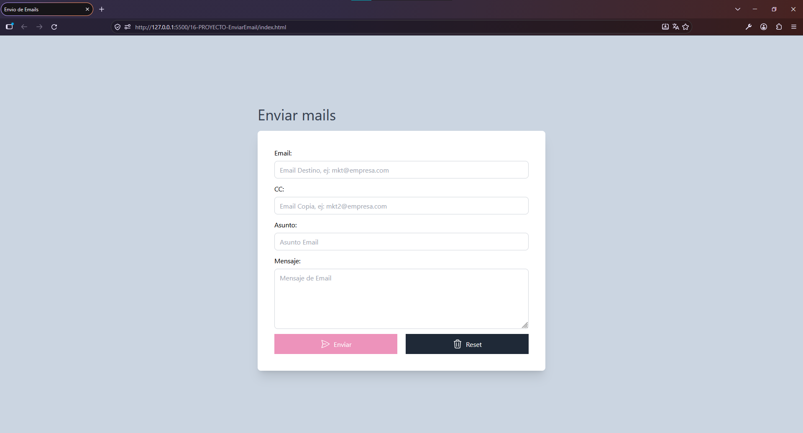

# 📧 Simulador de Envío de Emails

Aplicación web interactiva desarrollada como parte del curso **JavaScript Moderno: Guía Definitiva Construye +10 Proyectos**.

El proyecto simula el proceso de envío de un correo electrónico mediante un formulario, aplicando validaciones y manipulación dinámica de la interfaz con JavaScript.

## 🚀 Demo

[Disponible mediante GitHub Pages.](https://cristhianychr.github.io/simulador-envio-email-js/)

## 📸 Vista previa



## 🛠️ Tecnologías utilizadas

* HTML5
* Tailwind CSS
* JavaScript
* DOM
* Git
* GitHub Pages

## ✨ Funcionalidades

* Formulario para simular el envío de un correo electrónico.
* Validación de los campos del formulario.
* Mensajes de error para datos inválidos.
* Limpieza del formulario.
* Interacción dinámica con la interfaz.
* Simulación del proceso de envío.

## 🎯 Conceptos de JavaScript aplicados

* Manipulación del DOM.
* Event Listeners.
* Funciones.
* Validación de formularios.
* Condicionales.
* Manipulación de elementos HTML.
* Manejo de eventos.
* Expresiones regulares, si corresponde a la implementación.

## 📂 Estructura del proyecto

```text
simulador-envio-email-js/
│
├── dist/
├── img/
├── js/
├── index.html
├── .gitignore
└── README.md
```

## 🚀 Instalación

Clona el repositorio:

```bash
git clone https://github.com/cristhianychr/simulador-envio-email-js.git
```

Ingresa al proyecto:

```bash
cd simulador-envio-email-js
```

Abre `index.html` en tu navegador.

## 🎓 Curso

Proyecto desarrollado durante el curso:

**JavaScript Moderno: Guía Definitiva Construye +10 Proyectos**

## 👨‍💻 Autor

**Cristhian Chanamé**

Estudiante de Ingeniería de Software.
